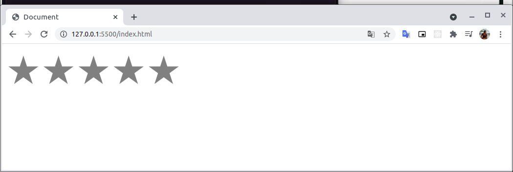
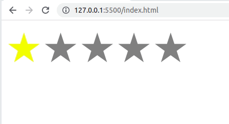

# Web Components - Shadow Dom

Esse projeto é baseado no [vídeo](https://www.youtube.com/watch?v=fZZAt0Sbz5k&ab_channel=Rocketseat).

- **(00:00) Introdução - Motivação**

    Encapsulamento de código através do artifício da Shadow Dom, web components.

    Exemplo tag video

- **(04:06) O que é Web Components?**

    Criar um componente abstraído e custumisado.

- **(06:00) Criando um novo projeto**

    Além da criação de uma pasta para conter o projeto, cria-se um arquivo `index.html`, nesse arquivo cria-se a ideia geral do componente `start-rater`

    ```html
    <!DOCTYPE html>
    <html lang="en">

    <head>
      <meta charset="UTF-8">
      <meta http-equiv="X-UA-Compatible" content="IE=edge">
      <meta name="viewport" content="width=device-width, initial-scale=1.0">
      <title>Document</title>
    </head>

    <body>
      <div class="star-rater">
        <span class="span" data-valeu="1">&#9733;</span>
        <span class="span" data-valeu="2">&#9733;</span>
        <span class="span" data-valeu="3">&#9733;</span>
        <span class="span" data-valeu="4">&#9733;</span>
        <span class="span" data-valeu="5">&#9733;</span>
      </div>
    </body>

    </html>
    ```

- **(09:57) Adicionando ao HTML o arquivo do componente**

    Antes do fim da body, iremos adicionar uma tag `script` com a referência para o arquivo onde conterá o componente `start-rater`

    ```html
    <script src="StarRater.js"></script>
    ```

    E na sequência, criamos o arquivo `StarRater.js` .

- **(10:30) Criando o componente**

    Para criar um componente é preciso que criemos uma classe que estende de `HTMLElement`

    ```jsx
    class StarRater extends HTMLElement {
    	constructor(){
    		super()
    	}
    }
    ```

    Após criarmos a classe, precisamos informar que estamos criando um elemento e ele poderá ficar disponível para uso. Para isso, iremos definir utilizando um objeto nativo dos navegadores que suportam WebComponents:

    ```jsx
    customElements.define('star-rater', StarRater)
    ```

    Nesse objeto temos o método `define` que recebe dois argumentos:

    1. **Nome da tag** que iremos utilizar no HTML. Esse nome sempre irá precisar ser composto por pelo menos 2 palavras separadas por hífen.
    2. **A classe** que representará a tag criada.

    Com isso, já podemos utilizar a tag `<star-rater></star-rater>` no arquivo `index.html`

    ```html
    <!DOCTYPE html>
    <html lang="en">

    <head>
      <meta charset="UTF-8">
      <meta http-equiv="X-UA-Compatible" content="IE=edge">
      <meta name="viewport" content="width=device-width, initial-scale=1.0">
      <title>Document</title>
    </head>

    <body>
      <div class="star-rater">
        <span class="span" data-valeu="1">&#9733;</span>
        <span class="span" data-valeu="2">&#9733;</span>
        <span class="span" data-valeu="3">&#9733;</span>
        <span class="span" data-valeu="4">&#9733;</span>
        <span class="span" data-valeu="5">&#9733;</span>
      </div>
      
      <star-rater></star-rater>

      <script src="StarRater.js"></script>
    </body>

    </html>
    ```

- **(13:32) Utilizando a ShadowDom para renderizar o componente**

    Para utilizarmos a ShadowDom precisamos primeiro cria-lá, para isso, dentro do construtor da classe `StarRater` iremos adicionar o seguinte código:

    ```jsx
    const shadow = this.attachShadow({mode: 'open'})
    ```

- **(17:31) Criação de uma função para criar os elementos para o componente**

    Dentro da classe `StarRater` iremos criar uma função `build` que será responsável por criar todos os elementos necessários para a construção da tag.

    Além disso, iremos precisar estilizar nosso componente, e para isso, iremos criar um função `styles` que criar um elemento `style` e através da função `textContent` do elemento criado, iremos adicionar a estilização ao nosso componente.

    ```jsx
    build(){}

    styles(){
    	const style = document.createElement('style')
    	style.textContent = `
    		.star-rater {
    		}
    	`
    	return style
    }
    ```

    Para adicionar esse elemento criado, basta adicionar como um filho da shadow que criamos:

    ```jsx
    shadow.appendChild(this.styles())
    ```

    Para melhorar na organização, iremos mudar o que estamos criando no construtor diretamente e mover para a função `build` e em sequência chamar essa função no construtor:

    ```jsx
    class StarRater extends HTMLElement {
      constructor() {
        super()

        this.build()
      }

      build() {
        const shadow = this.attachShadow({ mode: 'open' })
        shadow.appendChild(this.styles())
      }

      styles() {
        const style = document.createElement('style')
        style.textContent = `
          .star-rater {
          }
        `
        return style
      }
    }

    customElements.define('star-rater', StarRater)
    ```

- **(21:09) Criando elemento Rater**

    Para isso, irmos criar um função que irá construir o componente `Rater`:

    ```jsx
    createRater() {
    	const rater = document.createElement('div')
    	rater.classList.add('star-rater')
    	return rater
    }
    ```

- **(22:00) Criando elemento Stars**

    Aqui iremos implementar uma função que cria um `span` com a classe `span`:

    ```jsx
    createStars(){
    	const createStar = (_, id) => {
    		const star = documento.createElement('span')
    		star.classList.add('star')
    		star.setAttribute('data-value', Number(id) + 1)
    		star.innerHTML= '&#9733;'
    		return star
    	}

    	return Array.from({ length: 5 }, createStar)
    }
    ```

- **(27:33) Adicionado elementos a shadow dom**

    Na função `build` iremos adicionar os elementos criados através das funções para a shadow:

    ```jsx
    class StarRater extends HTMLElement {
      constructor() {
        super()

        this.build()
      }

      build() {
        const shadow = this.attachShadow({ mode: 'open' })
        shadow.appendChild(this.styles())
    		
    		// Criando a div.star-rater
        const rater = this.createRater()
        // Criando 5 span.star
        const stars = this.createStars()
    		// Adicionando cada span.star a div.star-rater
        stars.forEach(star => rater.appendChild(star))

    		// Adicionado div.star-rater a shadowDom
        shadow.appendChild(rater)
      }

      createRater() {
        const rater = document.createElement('div')
        rater.classList.add('star-rater')
        return rater
      }

      createStars() {
        const createStar = (_, id) => {
          const star = document.createElement('span')
          star.classList.add('star')
          star.setAttribute('data-value', Number(id) + 1)
          star.innerHTML = '&#9733;'
          return star
        }

        return Array.from({ length: 5 }, createStar)
      }

      styles() {
        const style = document.createElement('style')
        style.textContent = `
          .star-rater {
          }
        `
        return style
      }
    }

    customElements.define('star-rater', StarRater)
    ```

- **(32:58) Adicionado style as stars**

    Na função `styles` , adicionaremos ao texto uma estilização para as estrelinhas:

    ```jsx
    ...
    star.textContent = `
      .star {
    		font-size: 5rem;
    		color: gray;
    		cursor pointer;
    	}
    `
    ```

    O nosso elemento deve está ficando assim:

    

- **(35:00) Adicionado um evento ao elemento**

    Na criação da estrela, podemos adicionar um evento no `mouseover`  onde executará uma função que iremos definir o rater, ou seja, ao passarmos o mouse sobre as estrelas, iremos definir que aquela estrela que está com o mouse em cima é a quantidade de estrelas amarelas.

    ```jsx
    star.addEventListener('mouseover', this.setRating.bind(this))
    ```

    OBS.: o `bind` é para trazer o `this` da classe para dentro da função executada no `EventListener`

- **(40:13) Explicando a utilização do `data-reting`**

    Para definirmos um valor do `rating`, iremos atribuir um data a tag com essa informação:

    ```jsx
    <star-rater data-rating="1"></star-rater> 
    ```

    Então, quando passarmo o mouse por cima de uma estrela, precisamos pegar o valor da estrela e atribuir ao data-rating. Para fazermos isso basta atribuir a div o valor do elemento.

    ```jsx
    setRating(event) {
      this.setAttribute('data-rating', event.currentTarget.getAttribute('data-value'))
    }
    ```

    Como queremos que essa função só seja ativada quando clicarmos, basta alterar a declaração do evento de `mouseover` para `click`

    ```jsx
    star.addEventListener('click', this.setRating.bind(this))
    ```

- **(43:00) Criação da função `hover` para a estrela**

    No momento anterior removemos a função de definir a quantidade de estrelas para o clique da estrela, contudo, para termos uma melhor interação do componente, iremos definir uma nova função para quando passarmos o mouse sobre as estrelas.

    Essa função se chamará `ratingHover`, e definiremos ela do mesmo modo que definimos a função para o clique.

    ```jsx
    star.addEventListener('mouseover', this.ratingHover.bind(this))
    ```

    E logo em seguida, implementaremos a função:

    ```jsx
    ratingHover(event) {
    	// Atribuindo o valor corrente do rating para o estado global
      this.currentRatingValue = event.currentTarget.getAttribute('data-value')
    	// Método para saber quando devo ou não pintar as estrelas
      this.hightlightRating()
    }

    // Caso o valor corrente do rating seja maior ou igual ao valor da estrela,
    // ela deve ser amarela, caso contrário cinsa
    hightlightRating() {
      this.stars.forEach(star => {
        if (this.currentRatingValue >= star.getAttribute('data-value')) {
          star.style.color = 'yellow'
        } else {
          star.style.color = 'gray'
        }
      })
    }
    ```

- **(51:33) Criando a função `resetRating`**

    Essa função irá atribuir ao `currentRatingValeu` o valor que está sendo passo para o componente vai a tag e em seguida chamar a função que pinta as estrelas.

    ```jsx
    resetRating() {
      this.currentRatingValue = this.getAttribute('data-rating') || 0
      this.hightlightRating()
    }
    ```

    Essa função será chamada no primeiro momento, quando estivemos criando os componentes, ou seja, no método `build`

    ```jsx
    // ...
    this.stars.forEach(star => rater.appendChild(star))

    this.resetRating()

    shadow.appendChild(rater)

    //...
    ```

    Além disso, podemos atribuir a div, o mesmo comportamento para definir que quando o mouse sair ele retorno ao valor definido. Então, no método de criação da div adicionaremos a função a esse evento de saída do mouse:

    ```jsx
    createRater() {
      const rater = document.createElement('div')
      rater.classList.add('star-rater')
      rater.addEventListener('mouseout', this.resetRating.bind(this))

      return rater
    }
    ```

- **(55:20) Revisão sobre o que aprendemos**

    No HTML, temos a possibilidade de utilizar uma tag `star-rater` que irá ter as seguintes funções:

    - Iniciar um valor e ter essa quantidade de estrelas amarelas;
    - Escolher um novo rating ao clicar em uma estrela;
    - Ao passar o mouse por entre as estrelas, terá uma prévia da nova pontuação;

    Com isso, o código final ficou:

    ```html
    <!-- index.html -->

    <!DOCTYPE html>
    <html lang="en">

    <head>
      <meta charset="UTF-8">
      <meta http-equiv="X-UA-Compatible" content="IE=edge">
      <meta name="viewport" content="width=device-width, initial-scale=1.0">
      <title>Document</title>
    </head>

    <body>
      <star-rater data-rating="1"></star-rater>

      <script src="StarRater.js"></script>
    </body>

    </html>
    ```

    ```jsx
    // StarRater.js

    class StarRater extends HTMLElement {
      constructor() {
        super()

        this.build()
      }

      build() {
        const shadow = this.attachShadow({ mode: 'open' })
        shadow.appendChild(this.styles())
        const rater = this.createRater()
        this.stars = this.createStars()
        this.stars.forEach(star => rater.appendChild(star))

        this.resetRating()

        shadow.appendChild(rater)
      }

      createRater() {
        const rater = document.createElement('div')
        rater.classList.add('star-rater')
        rater.addEventListener('mouseout', this.resetRating.bind(this))

        return rater
      }

      createStars() {
        const createStar = (_, id) => {
          const star = document.createElement('span')
          star.classList.add('star')
          star.setAttribute('data-value', Number(id) + 1)
          star.innerHTML = '&#9733;'

          star.addEventListener('click', this.setRating.bind(this))
          star.addEventListener('mouseover', this.ratingHover.bind(this))

          return star
        }

        return Array.from({ length: 5 }, createStar)
      }

      resetRating() {
        this.currentRatingValue = this.getAttribute('data-rating') || 0
        this.hightlightRating()
      }

      setRating(event) {
        this.setAttribute('data-rating', event.currentTarget.getAttribute('data-value'))
      }

      ratingHover(event) {
        this.currentRatingValue = event.currentTarget.getAttribute('data-value')
        this.hightlightRating()
      }

      hightlightRating() {
        this.stars.forEach(star => {
          if (this.currentRatingValue >= star.getAttribute('data-value')) {
            star.style.color = 'yellow'
          } else {
            star.style.color = 'gray'
          }
        })
      }

      styles() {
        const style = document.createElement('style')
        style.textContent = `
          .star-rater {
          }
          .star {
            font-size: 5rem;
            color: gray;
            cursor: pointer;
          }
        `
        return style
      }
    }

    customElements.define('star-rater', StarRater)
    ```

    E o resultado final foi:



